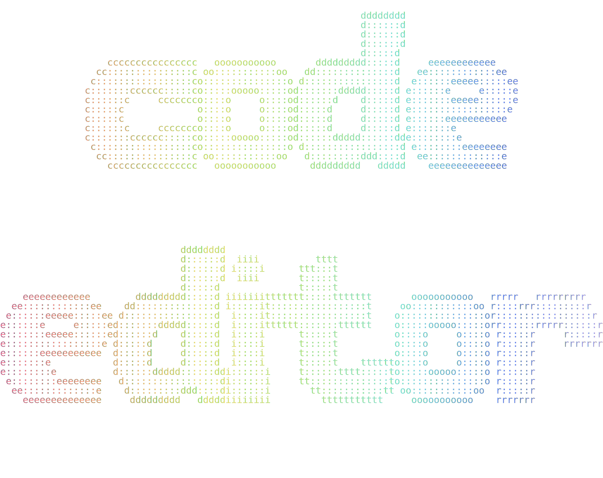

# Code Editor

  ![AOL](https://img.shields.io/badge/aol-3%20buddies%20online-fff?style=flat&logo=data:image/svg+xml;base64,PHN2ZyB4bWxucz0iaHR0cDovL3d3dy53My5vcmcvMjAwMC9zdmciIHdpZHRoPSIyMDAiIGhlaWdodD0iMjAwIiB2aWV3Qm94PSIwIDAgNDggNDgiIGZpbGw9IiNmZmZmZmYiPjxwYXRoIGZpbGw9Im5vbmUiIHN0cm9rZT0iI2ZmZmZmZiIgc3Ryb2tlLWxpbmVjYXA9InJvdW5kIiBzdHJva2UtbGluZWpvaW49InJvdW5kIiBkPSJNMTguMjA5IDQwLjg2TDQuNSA0MC44MzZsMTkuNTYtMzMuNzRsNS40ODMgOS41MzZtNS4wMDIgOC43TDQzLjUgNDAuOTA1aDBsLTE2LjQwMS0uMDNtNi45My0xNi40NGwuNTE2Ljg5N20tLjUxMy0uODk5Yy4wMDcgMi4wOTQtLjYwMiA0LjQxLTEuODYgNi41ODhoMGMtMS4yNDIgMi4xNTMtMi45OSAzLjkyMS00LjkzIDQuOTkyYy0yLjQxOSAxLjMzMy00LjkxOCAxLjQ2NS02LjgzMi4zNmMtMS4wNjItLjYxNC0xLjg2LTEuNTQ5LTIuMzgtMi42OTJjLTEuMjQtMi43MjQtLjkxMy02LjYyOCAxLjEzMy0xMC4xN2MuNDA3LS43MDcuODczLTEuMzc4IDEuMzg2LTEuOTk4bS02LjA2MSAxNS4xNDJjLTEuMjM1LTIuNzIzLS45MDYtNi42MjMgMS4xMzctMTAuMTYxYzEuMjQyLTIuMTUyIDIuOTg4LTMuOTIgNC45MjktNC45OWMyLjQxOC0xLjMzNSA0LjkxOC0xLjQ2NyA2LjgzNC0uMzYyYzEuMDYyLjYxNCAxLjg1OSAxLjU0OSAyLjM4IDIuNjkyYzEuMjQgMi43MjQuOTEyIDYuNjI4LTEuMTMzIDEwLjE3aDBhMTQuNTUzIDE0LjU1MyAwIDAgMS0xLjM5IDJtLTEyLjc0My42MzhjLTEuNDc2LTMuMDUtMS43NTMtNi45MDUtLjc2LTEwLjYwNmExNyAxNyAwIDAgMSAxLjg2OS00LjQwM20wIDBjLjA4NC0uMTM4LjE3LS4yNzQuMjU2LS40MW0wIDBjMi44ODEtNC40NDQgNy40My02LjYyNCAxMS41My01LjUyNWMuNzUzLjIwMiAxLjQ3NS41MSAyLjE1Mi45Mm00Ljk5NyA4LjcxM2MuMjIzIDIuMDA4LjA1NSA0LjExNC0uNDkgNi4xNDhoMGMtMS4xMTIgNC4xNTItMy42OTQgNy42NDQtNi45NTMgOS40MDltLTguODk4LS4wMTdjLTEuNTQ2LS45NDktMi44Mi0yLjQwNC0zLjcwMy00LjIzIi8+PC9zdmc+&label=AOL&labelColor=5B595C&color=78DCE8)      

  

Edit non-markdown text files (code, config, data files) directly in Obsidian with syntax highlighting, line numbers, and word wrap.

## Features

- Edit 50+ file types directly in Obsidian (JS, TS, Python, Go, Rust, JSON, YAML, HTML, CSS, SQL, and more)
- Syntax highlighting with 5 built-in color themes (Monokai Pro, GitHub Dark, GitHub Light, Dracula, Nord)
- Line numbers with active line highlighting
- Word wrap toggle
- Bracket matching
- Undo/redo history
- Tab indentation support
- Binary file detection (prevents editing binary files)
- Add custom file extensions

## Installation

### From Obsidian Community Plugins

**Not yet submitted**

1. Open **Settings** > **Community Plugins**
2. Search for **Code Editor**
3. Click **Install**, then **Enable**

### Manual Installation

1. Download `main.js`, `manifest.json`, and `styles.css` from the [latest release](../../releases/latest)
2. Create a folder called `code-editor` in your vault's `.obsidian/plugins/` directory
3. Copy the downloaded files into that folder
4. Restart Obsidian and enable the plugin in **Settings** > **Community Plugins**

## Usage

Once enabled, the plugin automatically handles supported file types. Simply open any supported file and it will open in the code editor.

### Supported File Types

**Code:** js, ts, jsx, tsx, py, rb, go, rs, java, c, cpp, h, cs, php, swift, kt, scala, lua, pl, r, m, mm

**Config/Data:** json, yaml, yml, toml, xml, ini, env, conf

**Web:** html, htm, css, scss, sass, less

**Shell/Scripts:** sh, bash, zsh, fish, ps1, bat, cmd

**Other:** sql, graphql, dockerfile, makefile, gitignore, txt, log

### Settings

- **Enable code editor** - Toggle the plugin on/off (restart required)
- **Color theme** - Choose from 5 syntax highlighting themes
- **Show line numbers** - Toggle line number gutter
- **Word wrap** - Toggle line wrapping
- **Additional file extensions** - Add custom extensions (comma-separated)

### Command

- **Open current file in Code Editor** - Available from the command palette for non-markdown files

## License

[MIT](LICENSE)
