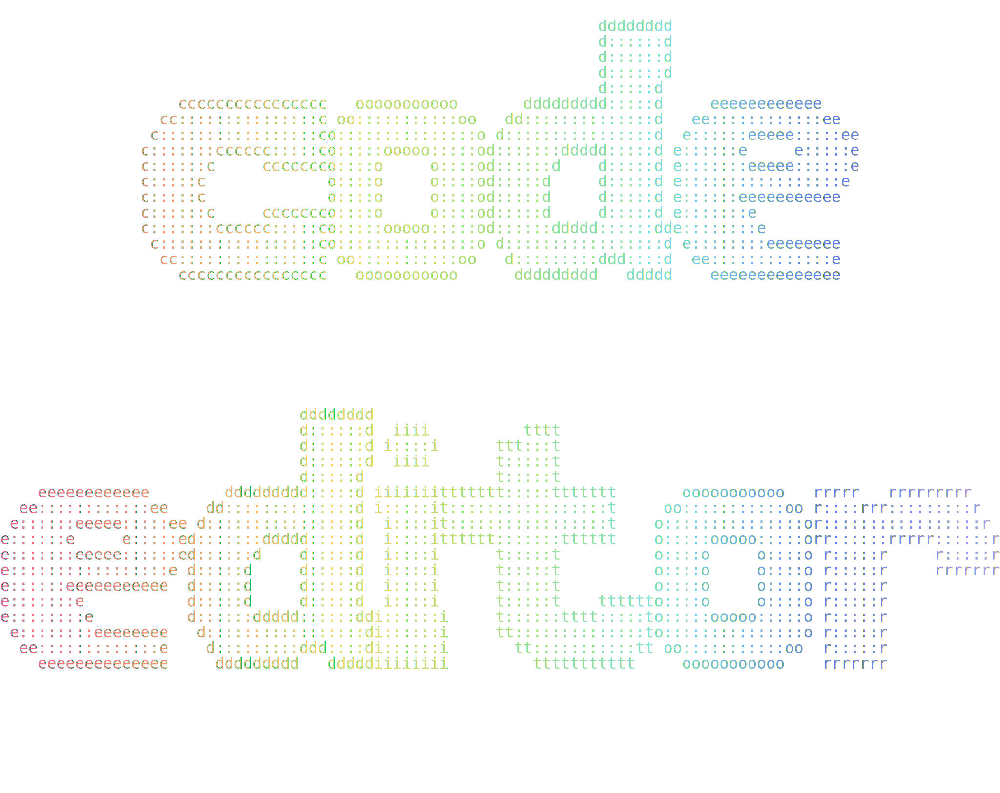
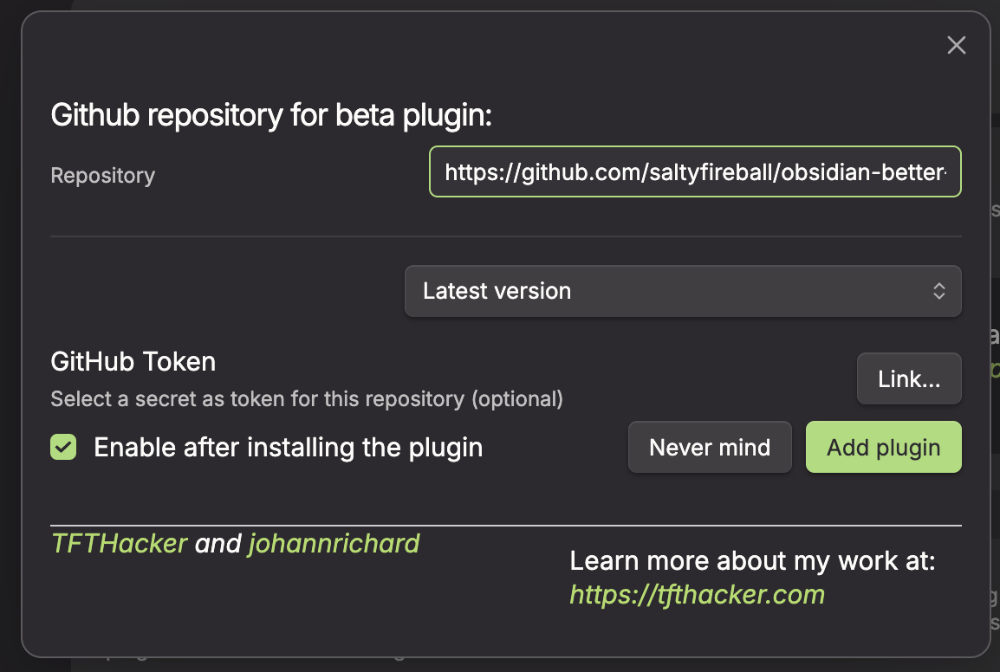

# Code Editor

        

  

Edit non-markdown text files (code, config, data files) directly in Obsidian with syntax highlighting, line numbers, and word wrap.

## Features

- Edit 50+ file types directly in Obsidian (JS, TS, Python, Go, Rust, JSON, YAML, HTML, CSS, SQL, and more)
- Syntax highlighting with 5 built-in color themes (Monokai Pro, GitHub Dark, GitHub Light, Dracula, Nord)
- Line numbers with active line highlighting
- Word wrap toggle
- Bracket matching
- Undo/redo history
- Tab indentation support
- Binary file detection (prevents editing binary files)
- Add custom file extensions

## Installation

### Obsidian Community Plugin (pending)

This plugin has been submitted for review to the Obsidian community plugin directory. Once approved, you will be able to install it directly from **Settings > Community plugins > Browse** by searching for "Code Editor".

### Using BRAT

You can install this plugin right now using the [BRAT](https://github.com/TfTHacker/obsidian42-brat) plugin:

1. Install BRAT from **Settings > Community plugins > Browse** (search for "BRAT" by TfTHacker)
2. Open the BRAT settings
3. Under the **Beta plugins** section, click **Add beta plugin**

   

4. In the overlay, enter this plugin's repository: `https://github.com/saltyfireball/obsidian-code-editor` (or just `saltyfireball/obsidian-code-editor`)

   

5. Leave the version set to latest

   

6. Click **Add plugin**

### Manual

1. Download the latest release from the [Releases](https://github.com/saltyfireball/obsidian-code-editor/releases) page
2. Copy `main.js`, `manifest.json`, and `styles.css` into your vault's `.obsidian/plugins/code-editor/` directory
3. Enable the plugin in **Settings > Community plugins**

## Usage

Once enabled, the plugin automatically handles supported file types. Simply open any supported file and it will open in the code editor.

### Supported File Types

**Code:** js, ts, jsx, tsx, py, rb, go, rs, java, c, cpp, h, cs, php, swift, kt, scala, lua, pl, r, m, mm

**Config/Data:** json, yaml, yml, toml, xml, ini, env, conf

**Web:** html, htm, css, scss, sass, less

**Shell/Scripts:** sh, bash, zsh, fish, ps1, bat, cmd

**Other:** sql, graphql, dockerfile, makefile, gitignore, txt, log

### Settings

- **Enable code editor** - Toggle the plugin on/off (restart required)
- **Color theme** - Choose from 5 syntax highlighting themes
- **Show line numbers** - Toggle line number gutter
- **Word wrap** - Toggle line wrapping
- **Additional file extensions** - Add custom extensions (comma-separated)

### Command

- **Open current file in Code Editor** - Available from the command palette for non-markdown files

## Acknowledgments

This plugin uses [highlight.js](https://github.com/highlightjs/highlight.js) for syntax highlighting, licensed under the [BSD 3-Clause License](https://github.com/highlightjs/highlight.js/blob/main/LICENSE). Copyright (c) 2006, Ivan Sagalaev.

## License

[MIT](LICENSE)
